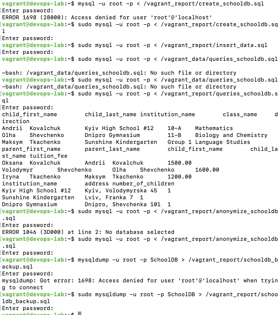

## Використано:

* **Vagrant** (VM: Ubuntu 24.04) з лекції 6

## Виконання з запитами були поміщені в файл

### файли запитів почергово по завданнях

- [Створення бази](../Lecture_6/devops-lab/report/create_schooldb.sql)
- [Додавання даних](../Lecture_6/devops-lab/report/insert_data.sql)
- [Вибірка даних](../Lecture_6/devops-lab/report/queries_schooldb.sql)
- [Анонімізація даних](../Lecture_6/devops-lab/report/anonymize_schooldb.sql)
- [Бекап бази](../Lecture_6/devops-lab/report/schooldb_backup.sql)