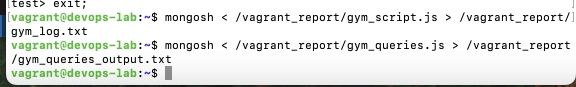

## Використано:

* **Vagrant** (VM: Ubuntu 24.04) з лекції 6

## Виконання з запитами були поміщені в файл

### файли запитів почергово по завданнях

- [Створення бази та колекцій + заповнення](../Lecture_6/devops-lab/report/gym_script.js)
- [Лог виконання створення + заповнення](../Lecture_6/devops-lab/report/gym_log.txt)
- [Вибірка даних](../Lecture_6/devops-lab/report/gym_queries.js)
- [Лог вибірки даних](../Lecture_6/devops-lab/report/gym_queries_output.txt)