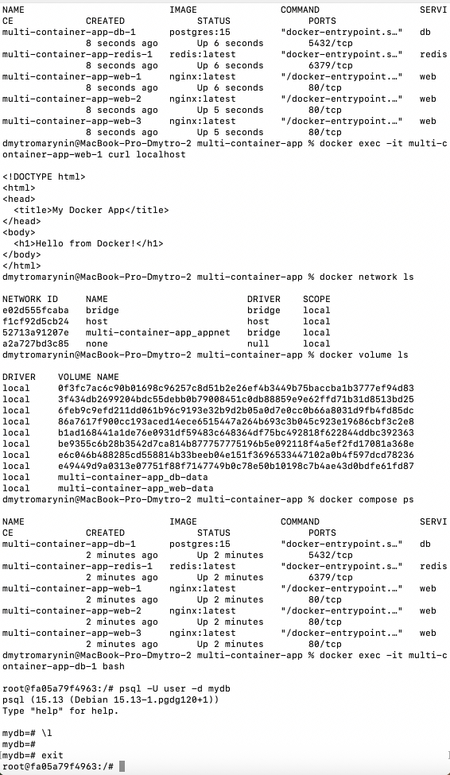

## Що реалізовано:

- Створено 3 сервіси: `nginx`, `postgres`, `redis`
- Використано [docker-compose.yml](../Lecture_17/multi-container-app/docker-compose.yml) для конфігурації
- Додано томи `web-data` і `db-data`
- Встановлено спільну мережу `appnet`
- Запущено застосунок командою `docker compose up -d`
- Проведено масштабування nginx до 3 екземплярів



## 🛠 Використані команди:

```bash
docker compose up -d
docker compose ps
docker network ls
docker volume ls
docker exec -it <db_container> bash
psql -U user -d mydb
```

### Проблеми при виконанні та вирішення

- Неможливо масштабувати nginx з привʼязаним портом 8080 (вирішено видаленням ports:)
- macOS не дозволяє напряму звернутись до Docker-мережі — перевірка через docker exec