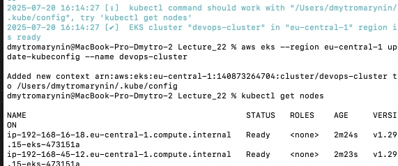
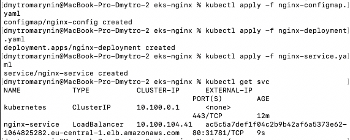
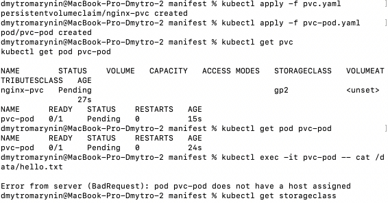
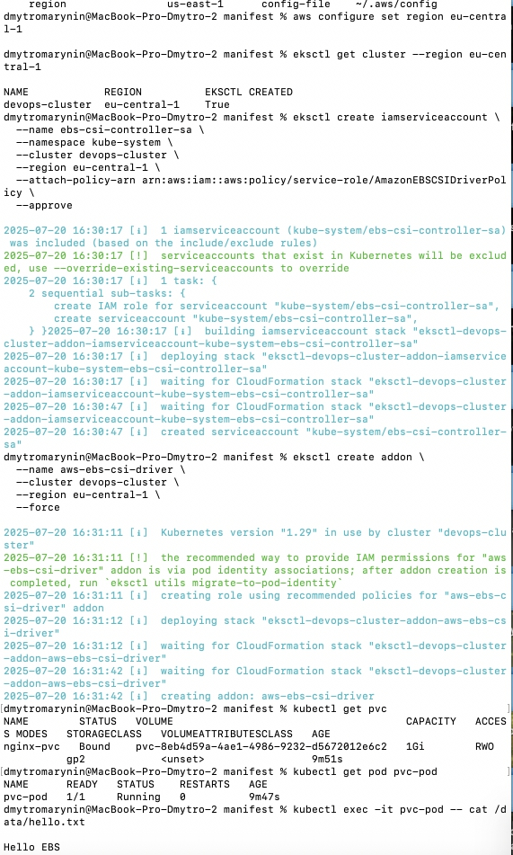
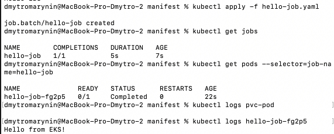
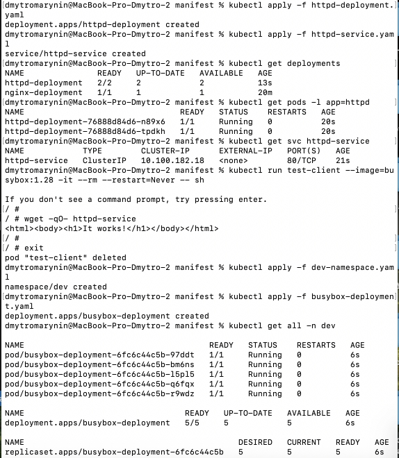
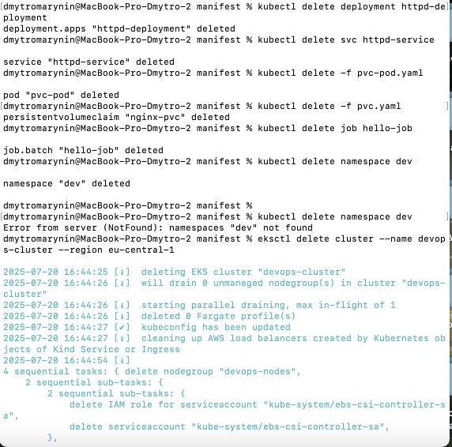

## Кроки

### 1. Створення кластера EKS

- Було встановлено для консолі AWS CLI, kubectl, eksctl та створено відповідні доступи та юзера щоб конектитись та управляти ресурсами. 
- Створили кластер
```
eksctl create cluster \
  --name devops-cluster \
  --region eu-central-1 \
  --zones eu-central-1a,eu-central-1b \
  --version 1.29 \
  --nodegroup-name devops-nodes \
  --node-type t3.small \
  --nodes 2 \
  --nodes-min 1 \
  --nodes-max 3 \
  --managed
```


### 2. Розгортання вебзастосунку (nginx/httpd)

[nginx-configmap.yaml](manifest/nginx-configmap.yaml)
[nginx-deployment.yaml](manifest/nginx-deployment.yaml)
[nginx-service.yaml](manifest/nginx-service.yaml)


### 3. PVC на EBS

[pvc-pod.yaml](manifest/pvc-pod.yaml)
[pvc.yaml](manifest/pvc.yaml)

#### Виникли в процесі проблеми з тим що не той регіон був вказаний. це було виправлено і протестовано. 


### 4. Job

[hello-job.yaml](manifest/hello-job.yaml)


### 5. Namespace + busybox

[dev-namespace.yaml](manifest/dev-namespace.yaml)
[busybox-deployment.yaml](manifest/busybox-deployment.yaml)


### 6. Очищення

