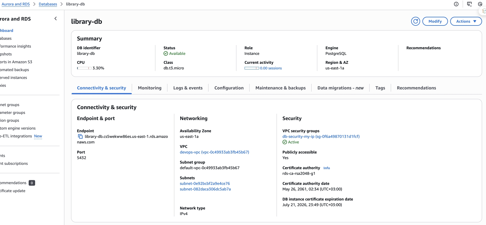
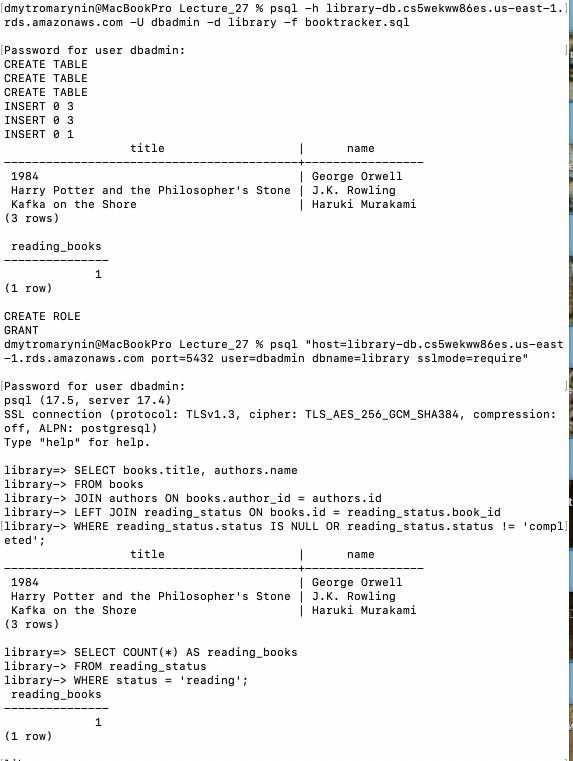
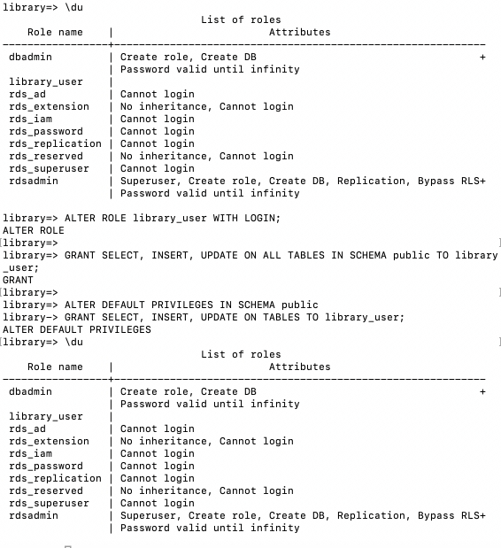
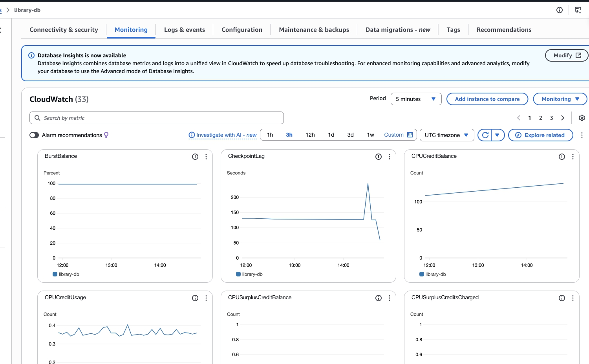
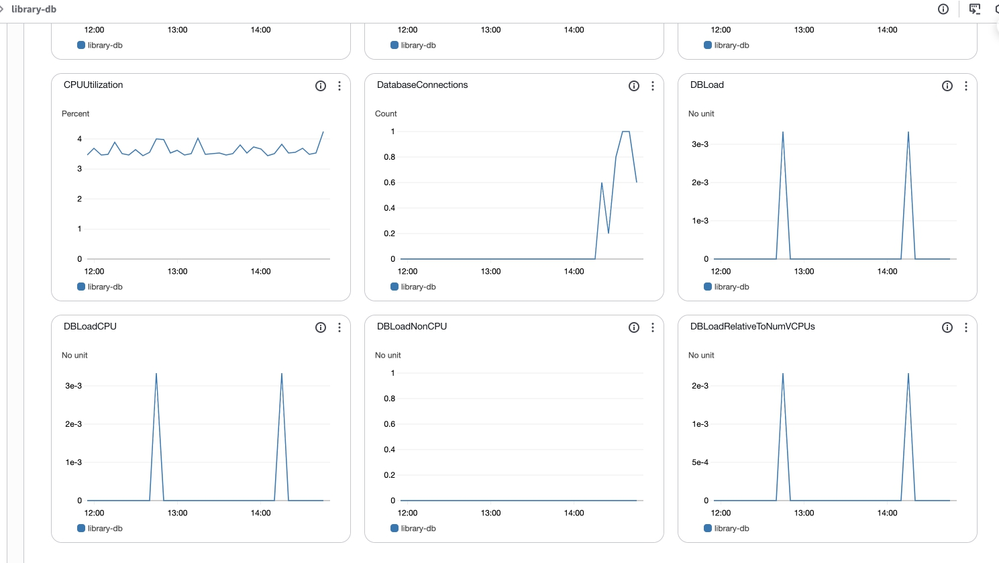

## Створили інстанс RDS

- Engine: PostgreSQL (Free Tier)
- DB instance identifier: library-db
- Username: dbadmin
- Пароль: задано під час створення
- Пам'ять: db.t3.micro, 20GB SSD
- Public access: увімкнено
- VPC Security Group: дозволено доступ лише з мого IP


## Підключення 

```
psql -h library-db.cs5wekww86es.us-east-1.rds.amazonaws.com -U dbadmin -d library
```

## Створення бази даних та внесення туди даних + запити для перевірки + створення юзера.

[файл з запитами для створення + юзер](booktracker.jpg)



## Переглянуто моніторинг


