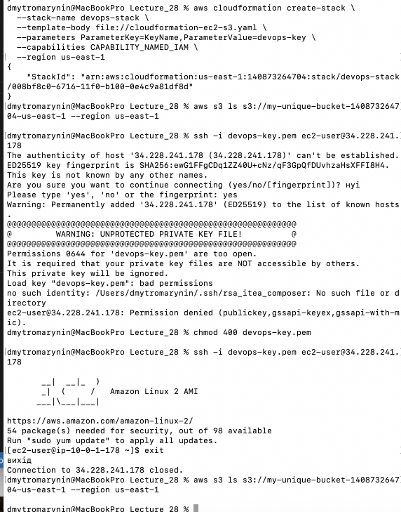
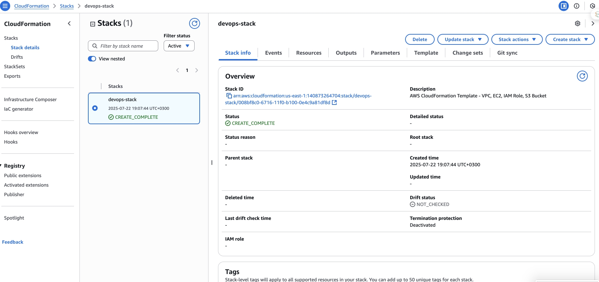
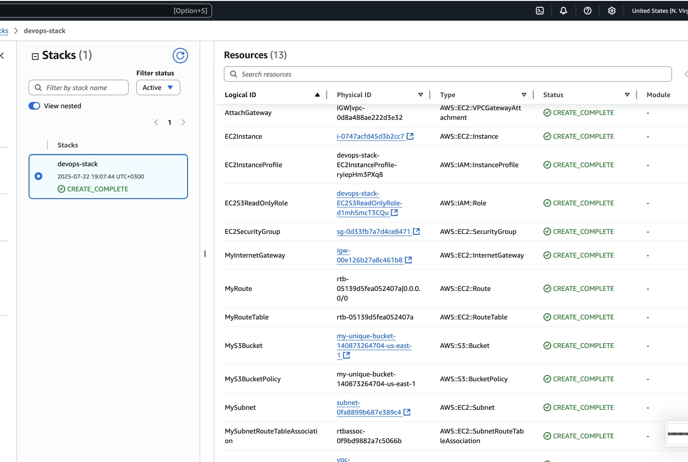
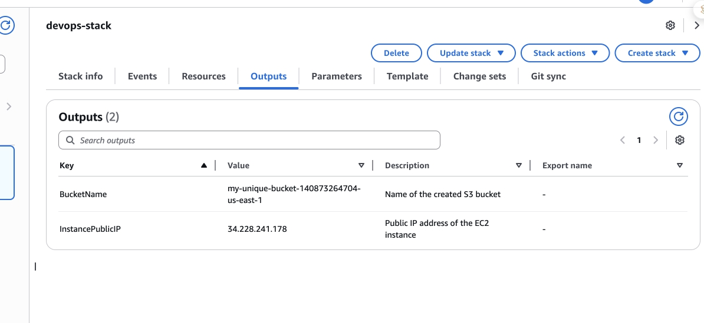

## Створено файл для виконання завдання.

Вся конфігурація була зібрана в цьому файлі - [cloudformation-ec2-s3.yaml](cloudformation-ec2-s3.yaml)
Запуск відбувався через aws cli

## Виконання

## Знімок стеку

