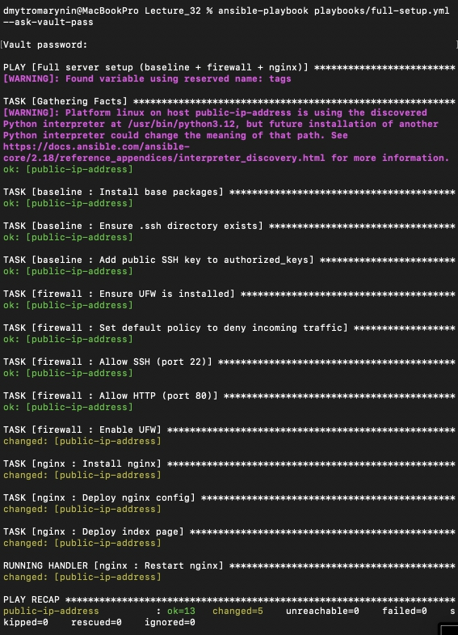
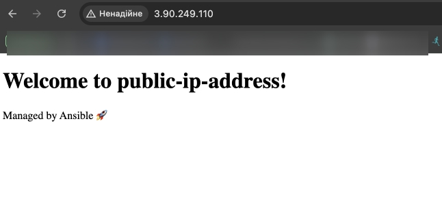

## Структура

├── ansible.cfg<br>
├── inventory/<br>
│ └── aws_ec2.yaml<br>
├── playbooks/<br>
│ ├── baseline.yml<br>
│ ├── firewall.yml<br>
│ ├── webserver.yml<br>
│ └── full-setup.yml<br>
├── roles/<br>
│ ├── baseline/<br>
│ ├── firewall/<br>
│ └── nginx/<br>
├── vault/<br>
│ └── secrets.yml<br>
├── group_vars/<br>
│ └── all.yml<br>


---

## Використані ролі

### `baseline`
- Встановлення пакетів: `vim`, `git`, `mc`, `ufw`
- Копіювання публічного SSH-ключа

### `firewall`
- Дозвіл портів 22 (SSH), 80 (HTTP)
- Блок усіх інших
- Вмикання `ufw`

### `nginx`
- Встановлення Nginx
- Генерація шаблону `nginx.conf`
- Деплой `index.html` з іменем хоста

---

## Dynamic Inventory

Файл `inventory/aws_ec2.yaml` використовує плагін `aws_ec2` для автоматичного виявлення EC2 з тегами `Name=devops-instance` та `Environment=dev`.

---

## Ansible Vault

Шифрування секретів (наприклад, `vault_admin_password`) у файлі `vault/secrets.yml`, який підключається через `group_vars/all.yml`.

---

## Запуск

```bash
ansible-playbook playbooks/full-setup.yml --ask-vault-pass
```


## Перевірка

Є підключення по ссш та працює сторінка за прямим запитом 