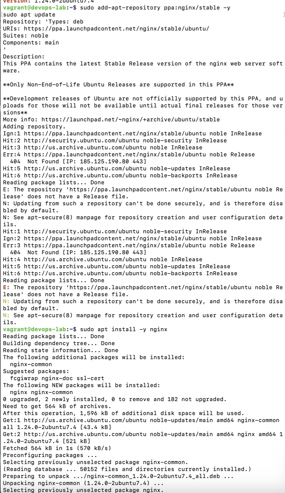
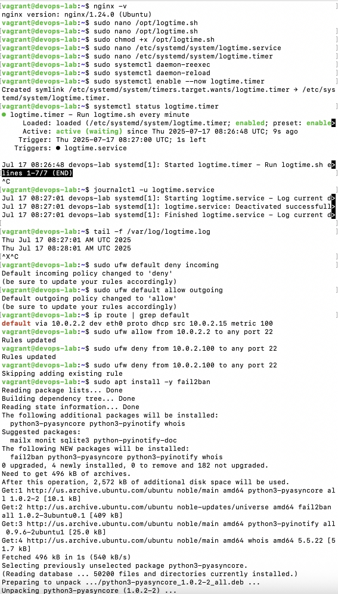
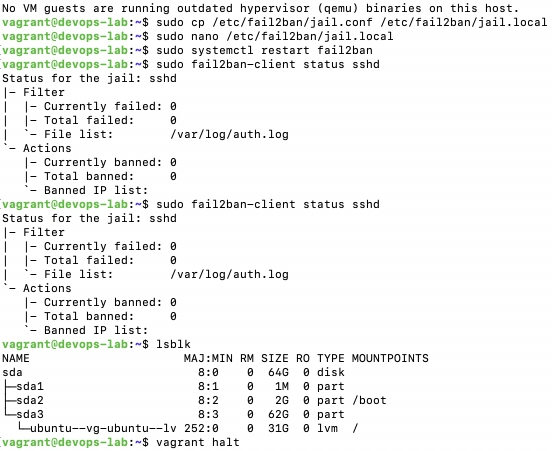

## Використано:

* **Vagrant** (VM: Ubuntu 24.04)
* **Nginx**
* **ppa-purge**
* **Systemd**
* **UFW**
* **Fail2Ban**

## Виконано:

### 1. Встановлення Nginx

```bash
sudo apt update && sudo apt install nginx
```

### 2. Додавання PPA-репозиторію

```bash
sudo add-apt-repository ppa:nginx/stable
sudo apt update && sudo apt install nginx
```

### 3. Видалення PPA через ppa-purge

```bash
sudo apt install ppa-purge
sudo ppa-purge ppa:nginx/stable
```

### 4. Systemd-сервіс (логування часу щохвилини)

* Створено файл `/usr/local/bin/write-time.sh`:

```bash
#!/bin/bash
date >> /var/log/time.log
```

* Сервіс `/etc/systemd/system/time-logger.service`
* Таймер `/etc/systemd/system/time-logger.timer`
* Активовано:

```bash
sudo systemctl daemon-reexec
sudo systemctl enable --now time-logger.timer
```

### 5. Налаштування UFW

* Дозволено власний IP (локальний)
* Заборонено інший IP на порт 22

```bash
sudo ufw allow from <YOUR_IP> to any port 22
sudo ufw deny from <BLOCKED_IP> to any port 22
sudo ufw enable
```

### 6. Налаштовано Fail2Ban

* Jail `sshd` активований у `/etc/fail2ban/jail.local`

```ini
[sshd]
enabled = true
port    = ssh
logpath = %(sshd_log)s
```

* Запуск:

```bash
sudo systemctl enable --now fail2ban
```

---

## Виконання



